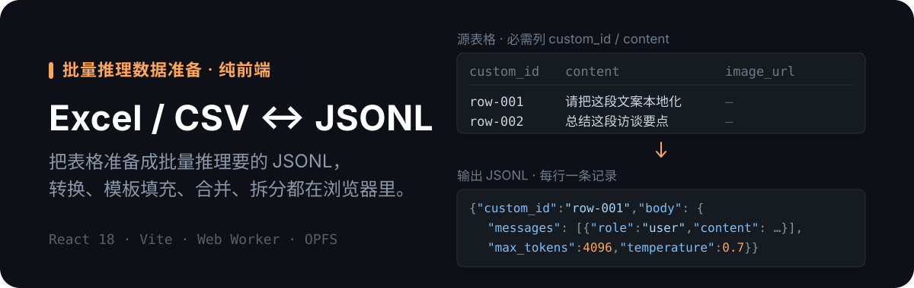

<p align="center">
  
</p>

<p align="center">
  
  
  
  
</p>

# Excel / CSV ↔ JSONL 数据工具

纯前端单页工具，用于准备、转换和拆分**批量推理数据**。界面由六个模块组成；除「上下文缓存」外，文件处理都在浏览器本地完成。

服务对象：需要把表格整理成 JSONL、把模型批处理结果还原为 CSV，或做 CSV 合并 / 拆分的运营、数据和 AI 工作流。

## 六个模块

| 模块 | 输入 | 输出 / 行为 |
|---|---|---|
| **Excel / CSV 转 JSONL** | `.xlsx`、`.xls`、`.csv`；必需列 `custom_id`、`content`，可选 `image_url` | 逐行生成批量推理 JSONL，校验空值和重复 `custom_id` |
| **CSV 模板填充** | `.csv`、`.xlsx`、`.xls` + `{{列名}}` 模板 | 在原数据上生成 `content` 列并导出 CSV |
| **JSON / JSONL 转 CSV** | `.json`、`.jsonl` | 展平常见 Batch / Responses 结果，优先输出 `custom_id`、`content`、`output`、`reasoning_content` |
| **合并 CSV** | 多个 CSV 或本次会话的历史结果 | 合并表头并导出一个 CSV |
| **上下文缓存** | API Key、模型 ID、系统内容、Thinking、TTL | 通过 `/ark/api/v3/responses` 创建前缀缓存，可按响应 ID 删除 |
| **拆分 CSV** | `.csv` | 每个 Excel 分片最多 20,000 行（表头、两行空行及数据），多个分片打包为 ZIP |

六个模块是同一页面内的状态切换，**没有独立 URL 路由**。转换、合并和模板填充使用 Web Worker；较大的临时结果写入浏览器 OPFS，并在页面卸载时清理。

`image_url` 有值时，`content` 会自动改写成 `[{type:"image_url",…},{type:"text",…}]` 的多模态结构。

## 本地开发

需要 Node.js 18 或更高版本。

```bash
cd web_converter
npm install
npm run dev
```

开发服务器通过 Vite 把 `/ark/*` 转发到火山方舟 API。生产构建：

```bash
cd web_converter
npm run build
npm run preview
```

产物位于 `web_converter/dist/`。仓库根目录的 `npm run build` 会重新安装子项目依赖、构建并复制产物到根目录 `dist/`；**日常校验优先在 `web_converter/` 内构建**，避免无意改动锁文件。不要手工编辑带 hash 的 `dist/assets/*`。

当前没有自动化测试脚本；`npm run build` 是最低限度的静态验证。

<details>
<summary><b>项目结构与脚本</b></summary>

```text
.
├── package.json              # 根目录部署构建包装脚本
├── vercel.json               # 静态托管配置
├── web_converter/            # 主前端应用
│   ├── src/
│   │   ├── App.tsx           # 主工作台与模块切换
│   │   ├── ContextCacheCreator.tsx
│   │   ├── CsvTemplateFiller.tsx
│   │   ├── SplitTool.tsx
│   │   ├── *Worker.ts        # 转换、拆分、合并 worker
│   │   └── components/       # 应用框架、上传、结果和侧栏组件
│   ├── package.json
│   └── vite.config.ts
├── 上下文缓存.md
├── 上下文缓存模型列表.md
└── README.md
```

根目录脚本：

| 命令 | 说明 |
| --- | --- |
| `npm run install-modules` | 安装 `web_converter/` 内的依赖 |
| `npm run build` | 构建前端并复制产物到根目录 `dist/` |

`web_converter/` 内脚本：

| 命令 | 说明 |
| --- | --- |
| `npm run dev` | 启动 Vite 开发服务 |
| `npm run build` | 构建生产产物 |
| `npm run preview` | 预览生产构建 |

</details>

## 数据与安全边界

- 普通转换模块不会把所选文件上传到应用后端，但浏览器的下载、剪贴板和本地文件能力仍受浏览器权限约束。
- **上下文缓存模块会把 API Key 放在 `Authorization` 请求头中**，并把填写的内容发送到火山方舟。仅在数据允许离开本地浏览器时使用该模块；不要把 Key 写入源码、示例或提交记录。
- 部署环境必须保留 `/ark/*` 的反向代理；缺失时缓存模块会返回 405 或网关错误。
- 预置模型 ID、价格与平台限制可能变化，运行前以官方文档为准，不在仓库复制整份模型清单。
- `examples/context-cache-food-localization.txt` 是保真迁移的内部示例载荷，不是项目说明，也不会被应用自动加载；**对外分享仓库前先审查其内容**。
- 仓库历史中包含构建产物和依赖目录，日常开发应以 `web_converter/src/` 为准。
- 当前仓库没有单独的 license 文件。

## 代码入口

| 文件 | 职责 |
|---|---|
| `web_converter/src/App.tsx` | 模块导航与转换工作流 |
| `web_converter/src/ContextCacheCreator.tsx` | Responses API 缓存创建与删除 |
| `web_converter/src/CsvTemplateFiller.tsx` | 模板填充 |
| `web_converter/src/SplitTool.tsx` | CSV 拆分 |
| `web_converter/src/*Worker.ts`、`worker.ts` | 后台转换与 OPFS 写入 |
| `web_converter/vite.config.ts`、`vercel.json` | `/ark` 代理与部署入口 |

这是通用浏览器端文件转换工具，不依赖飞书多维表格，也不是海报、报名或短链业务系统。
